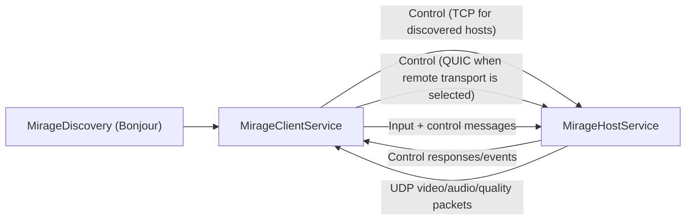
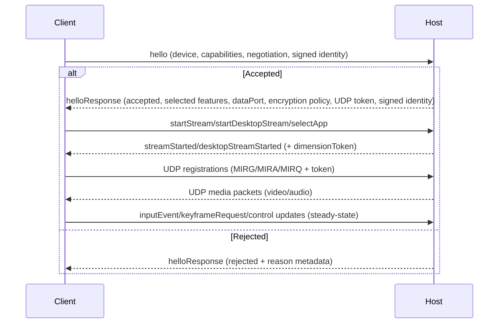

# MirageKit Architecture

This document describes MirageKit’s package-level architecture: module boundaries, connection and media flow, stream pipelines, and runtime policies.

## System Topology

MirageKit is split into three SwiftPM products:

- `MirageKit`: shared protocol/types/security/logging/bootstrap/remote helpers.
- `MirageKitClient`: client service, decode pipeline, render pipeline, and stream views.
- `MirageKitHost`: host service, capture/encode pipeline, virtual-display orchestration, and input injection.

## Core Public Entry Points

- `MirageHostService` is the host orchestrator (`@Observable`, `@MainActor`).
- `MirageClientService` is the client orchestrator (`@Observable`, `@MainActor`).
- `MirageDiscovery` provides Bonjour host discovery.
- `MirageStreamViewRepresentable` + `MirageStreamContentView` bridge stream rendering/input into SwiftUI.
- `MirageClientSessionStore` owns client-side session/UI stream state.
- `MirageEncoderConfiguration`, `MirageEncoderOverrides`, and `MirageNetworkConfiguration` define media/network policy.
- `MirageHostWindowController` + `MirageHostInputController` handle host window/input coordination.
- `MirageTrustStore`, `MirageAppPreferences`, and `MirageStreamingSettings` provide shared settings surfaces.

## Internal Module Map

- Shared protocol and security:
  - `MirageProtocol`, `ControlMessage`, `FrameHeader`, `AudioPacketHeader`.
  - `MirageProtocolNegotiation` + `MirageFeatureSet`.
  - `MirageMediaSecurity` (ECDH/HKDF key derivation + ChaCha20-Poly1305 packet encryption).
  - `MirageReplayProtector` for nonce/timestamp replay defense.
- Host pipeline:
  - `WindowCaptureEngine` (`ScreenCaptureKit` capture and frame extraction).
  - `HEVCEncoder` (VideoToolbox session lifecycle and runtime quality control).
  - `StreamPacketSender` (fragmentation, pacing, parity fragments, packet send queueing).
  - `StreamContext` (per-stream state machine, backpressure, quality/keyframe policy).
  - `SharedVirtualDisplayManager` (dedicated per-stream displays and shared-consumer displays).
  - `AppStreamManager` (app selection/session/window lifecycle).
  - `HostReceiveLoop` + `HostTransportRegistry` (control receive and transport send routing).
- Client pipeline:
  - `StreamController` (per-stream decode/recovery/metrics loop).
  - `FrameReassembler` + `HEVCDecoder`.
  - `MirageRenderStreamStore` (per-stream SPSC frame queues + telemetry).
  - `MirageFrameCache` (compatibility facade over render store).
  - `MetalRenderer` + `MirageRenderLoop` (macOS render path).
  - AVSampleBufferDisplayLayer path in `MirageMetalView+iOS` (iOS/visionOS render path).

## Connection and Session Security

- Hello negotiation requires `identityAuthV2`, `udpRegistrationAuthV1`, and `encryptedMediaV1` for accepted sessions.
- Both peers validate signed identity envelopes and replay constraints before establishing media context.
- Host enforces a single-client slot; a reconnect with the same device ID or identity key preempts the existing slot.
- Hello response carries a per-session UDP registration token; host validates token matches in constant time.
- Media payload encryption policy is session-scoped (peer-to-peer sessions may allow unencrypted payloads when configured; non-peer-to-peer sessions stay encrypted).

## Control and Media Transport

- Control plane uses `ControlMessage` frames (`type + payload length + payload`) over control connection.
- Most control payloads are JSON-encoded Codable structs.
- `inputEvent` payloads use `InputEventBinaryCodec` v1, with JSON fallback for legacy peers.
- Host control receive is handled by `HostReceiveLoop`:
  - immediate receive re-arm,
  - bounded non-input backlog,
  - coalescing for high-frequency control updates (`displayResolutionChange`, `streamScaleChange`, `streamRefreshRateChange`, `streamEncoderSettingsChange`),
  - fail-closed disconnect on invalid control frames.
- UDP registrations and channels:
  - `MIRG`: video registration + video packet flow.
  - `MIRA`: audio registration + audio packet flow.
  - `MIRQ`: quality-test transport.

## Stream Pipelines

### Host

1. `MirageHostService` creates a `StreamContext` with resolved encoder/runtime policy.
2. `StreamContext` starts capture (`WindowCaptureEngine`) and encoder (`HEVCEncoder`).
3. Encoded frames are packetized in `StreamPacketSender` and sent through host transport registry routing.
4. Backpressure is queue-based and drop-first; sustained pressure can trigger queue reset + urgent recovery keyframe.

### Client

1. `MirageClientService` creates one `StreamController` per stream.
2. UDP packets go through `FrameReassembler` and then `HEVCDecoder`.
3. Decoded frames are enqueued into `MirageRenderStreamStore` (`MirageFrameCache` facade).
4. Presentation backend consumes frames per platform policy.

## Rendering by Platform

- macOS:
  - `MirageMetalView+macOS` uses `CAMetalLayer`.
  - `MirageRenderLoop` is completion-driven and schedules draws off decode arrival and display pulses.
  - Presentation policy follows latency mode (`latest` for lowest-latency and auto-typing, buffered for smoothest/auto-smooth).
- iOS/visionOS:
  - `MirageMetalView+iOS` is backed by `AVSampleBufferDisplayLayer`.
  - `CADisplayLink` drives dequeue/enqueue cadence.
  - Presentation policy is fixed newest-frame dequeue + immediate sample-buffer enqueue.

## Streaming Modes and Virtual Displays

- Window/app stream startup uses a dedicated virtual display path first (`SharedVirtualDisplayManager.acquireDedicatedDisplay`), then falls back to direct window capture if dedicated-display startup fails.
- Desktop/login flows use shared-consumer virtual-display acquisition (`acquireDisplayForConsumer`).
- Desktop supports mirrored and secondary-display modes (`MirageDesktopStreamMode`).
- Resize and hard-reset coordination use `dimensionToken` (same stream ID, token increments on host-side dimension resets).
- Frame headers include `contentRect` so clients crop ScreenCaptureKit padding correctly.

## Quality and Latency Policy

- `MirageEncoderOverrides` and start-stream message fields allow per-stream overrides:
  - bitrate, keyframe interval, bit depth, stream scale, capture queue depth,
  - latency mode (`smoothest`, `lowestLatency`, `auto`),
  - performance mode (`standard`, `game`),
  - runtime quality adjustment toggle,
  - resolution-cap disable flag.
- Resolution handling:
  - host encode dimensions are normally capped at 5K (`5120x2880`);
  - `disableResolutionCap` bypasses this cap for uncapped mode.
- Keyframe policy is recovery-first (`recoveryOnlyKeyframes` path in `StreamContext`) with soft/hard recovery escalation and explicit urgent keyframe paths.
- Client decode recovery includes keyframe-only gating and controlled retry loops through `StreamController`.

## Input and Audio

- Input path:
  - client emits `MirageInputEvent`,
  - encoded in compact binary payload,
  - host decodes and routes through `MirageHostInputController`.
  - `InputStreamCacheActor` maintains stream/window mapping for fast coordinate routing.
- Audio path:
  - single mixed audio stream per client session,
  - dedicated UDP registration/transport (`MIRA`),
  - host capture from active ScreenCaptureKit source stream,
  - client playback via jitter buffer + decoder + playback controller.

## Optional Subsystems in MirageKit

- Remote signaling surface:
  - `MirageRemoteSignalingClient` for signed signaling requests.
  - `MirageStunProbe` for candidate reachability checks.
  - host remote listener path in `MirageHostService+Remote` (QUIC control listener).
- Bootstrap/wake/unlock surface:
  - `MirageBootstrapMetadata`, `MirageBootstrapEndpointResolver`,
  - `MirageWakeOnLANClient`, `MirageSSHBootstrapClient`, `MirageBootstrapControlClient`.
- Diagnostics and instrumentation:
  - `MirageDiagnostics` multi-sink/context-provider registry.
  - `MirageInstrumentation` multi-sink event registry.
